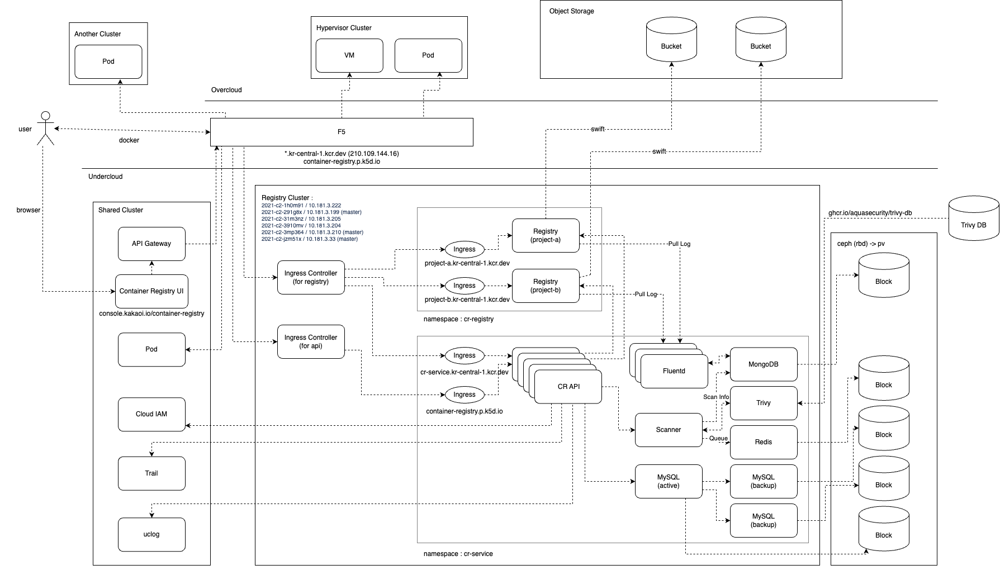

## CR Service

## 배포 아키텍처


## 배포
```
helm install container-registry -f values-stg.yaml -n cr-service .
```

## 삭제
```
helm delete container-registry
```

## Values
| Key | Description | Default |
|---|:---|:---|
| `namespace` | k8s 네임스페이스 | `default` |
| `serviceAccount` | resource 에서 사용할 SA | `cr-service-sa` |
| `createNamepsaces` | 생성해야 될 네임스페이스 | `[]` |
| `containerRegistry.name` | container registry k8s resource 이름 | `container-registry` |
| `containerRegistry.profile` | container registry active spring profile | `` |
| `containerRegistry.replicaCount` | container registry replica 갯수 | `1` |
| `containerRegistry.hostAliases` | container registry hosts 설정 | `[]` |
| `containerRegistry.image` | container registry 사용할 이미지 path | `boozer83/container-registry:latest` |
| `containerRegistry.resources` | container registry 리소스 설정 | `{}` |
| `containerRegistry.service.type` | container registry 서비스 타입 | `NodePort` |
| `containerRegistry.service.nodePort` | container registry 서비스 타입이 NodePort 일 경우 사용 | `` |
| `containerRegistry.ingress.enabled` | container registry ingress 사용 여부 | `true` |
| `containerRegistry.ingress.annotations` | container registry ingress annotations | `{}` |
| `containerRegistry.ingress.hosts` | container registry ingress host 정보 | `[]` |
| `containerRegistry.ingress.tls.enabled` | container registry ingress tls 사용여부 | `false` |
| `containerRegistry.ingress.tls.secretName` | container registry ingress tls 시크릿 | `` |
| `db.name` | db k8s resource 이름 | `db` |
| `db.image` | db 사용할 이미지 path | `mariadb:10.6.5` |
| `db.resources` | db 리소스 설정 | `{}` |
| `db.affinity` | db 배포 대상 노드 정의 | `{}` |
| `db.env` | db environment 정의 | `` |
| `db.volume` | db pv/pvc 정보 | `` |
| `db.service.type` | db 서비스 타입 | `NodePort` |
| `db.service.nodePort` | db 서비스 타입이 NodePort 일 경우 사용 | `` |
 
### Override values
| File                   | Description           |
|------------------------|:----------------------|
| `values-stg.yaml`      | kr-central-1 stg      |
| `values-prod.yaml`     | kr-central-1 prod     |
| `values-gov.yaml`      | kr-gov-central-1 prod |
| `values-kr2-prod.yaml` | kr-central-2 prod     |
| `values-kr2-stg.yaml`  | kr-central-2 stg      |
